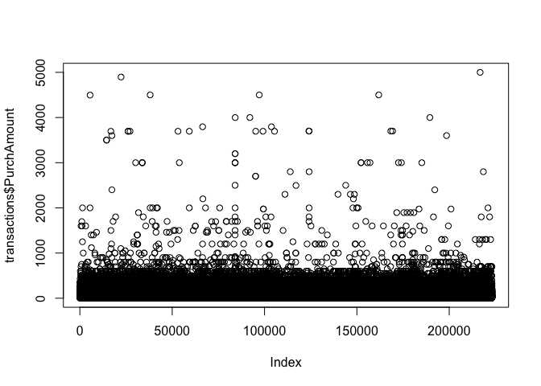

<!-- README.md is generated from README.Rmd. Please edit that file -->

# TestPackage

<!-- badges: start -->
<!-- badges: end -->

The goal of TestPackage is to …

## Installation

You can install the released version of TestPackage from
[CRAN](https://CRAN.R-project.org) with:

``` r
install.packages("TestPackage")
```

And the development version from [GitHub](https://github.com/) with:

``` r
# install.packages("devtools")
devtools::install_github("CC89/RAdvanced")
```

## Example

This is a basic example which shows you how to solve a common problem:

``` r
library(TestPackage)
## basic example code
myFun(5)
#> [1] 6
myFun(5,5)
#> [1] 10
```

## Data

This package also includes transaction data.

``` r
data("transactions")
```

What is special about using `README.Rmd` instead of just `README.md`?
You can include R chunks like so:

``` r
summary(transactions)
#>     Customer           TransDate         Quantity     
#>  Min.   :100001   12.04.2007:   614   Min.   : 1.000  
#>  1st Qu.:123563   12.10.2007:   606   1st Qu.: 1.000  
#>  Median :148635   12.07.2010:   604   Median : 1.000  
#>  Mean   :148367   12.08.2009:   599   Mean   : 1.037  
#>  3rd Qu.:172467   12.12.2011:   596   3rd Qu.: 1.000  
#>  Max.   :199999   12.08.2008:   594   Max.   :70.000  
#>                   (Other)   :219578                   
#>   PurchAmount           Cost            TransID         
#>  Min.   :   0.00   Min.   :   0.00   Min.   :123456799  
#>  1st Qu.:  34.95   1st Qu.:  14.03   1st Qu.:125972150  
#>  Median :  59.95   Median :  24.00   Median :128272799  
#>  Mean   :  84.17   Mean   :  39.01   Mean   :127995476  
#>  3rd Qu.:  99.95   3rd Qu.:  45.00   3rd Qu.:129188739  
#>  Max.   :5000.00   Max.   :3100.00   Max.   :132481165  
#>                                                         
#>     TransKey     
#>  Min.   :100000  
#>  1st Qu.:155798  
#>  Median :211595  
#>  Mean   :211595  
#>  3rd Qu.:267392  
#>  Max.   :323190  
#> 
```

You’ll still need to render `README.Rmd` regularly, to keep `README.md`
up-to-date.

You can also embed plots, for example:



In that case, don’t forget to commit and push the resulting figure
files, so they display on GitHub!
